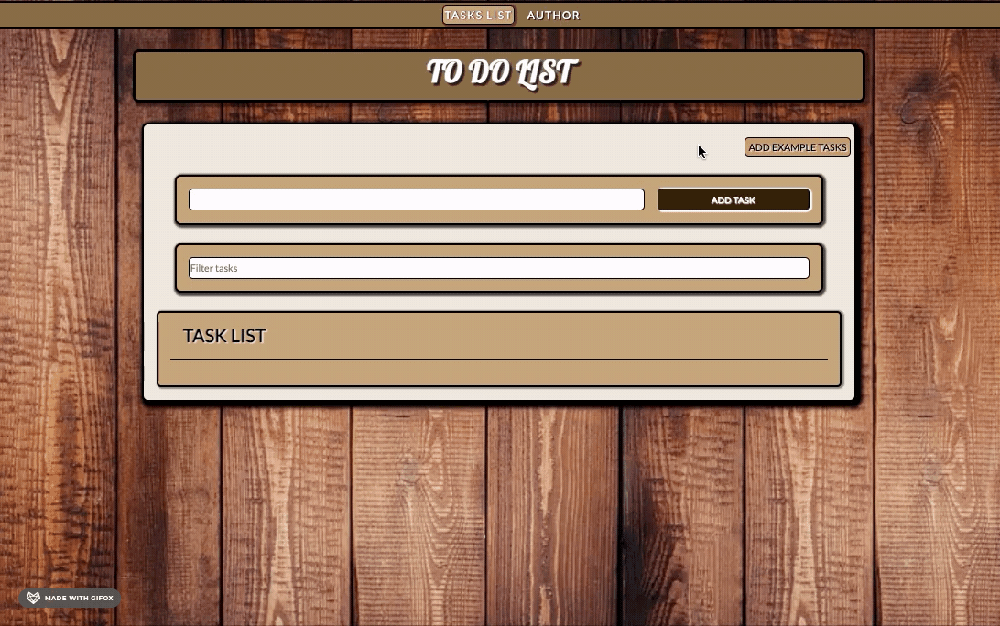
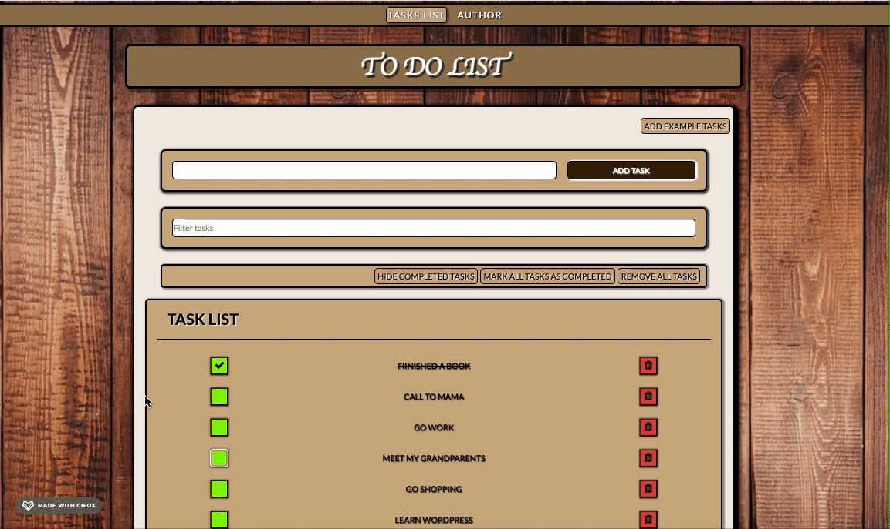
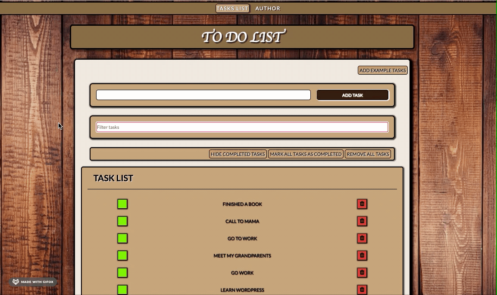
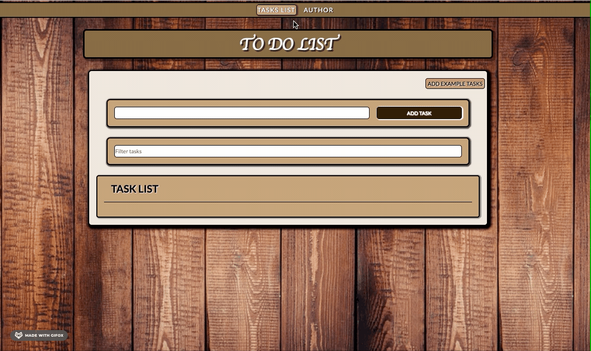

# TO DO LIST

Simple and basic to-do list - helps organise tasks.
Made during the frontend developer course from [“youcode.pl”](https://youcode.pl).
This project was bootstrapped with [Create React App](https://github.com/facebook/create-react-app).

**Live link:** [https://m4dzix.github.io/todo-list-react/](https://m4dzix.github.io/todo-list-react/)

## How to use:

### Creating task

If you want to add a new task to the list, you should:

1. Enter the task content on the input area.

2. Confirm by clicking button `Add task` or just press enter.

3. You can also add example tasks by cliking button `Add example tasks`

Task content will show up as a part of the task list.

### Managing task

- Mark as complete: Click green box on left from task content.
  Second click on confirmed icon will reverse 'completed' animation.

- Mark all tasks as completed: click on button `MARK ALL TASKS AS COMPLETED` on menubar above task list.
  

- Hide each completed task: click the `HIDE COMPLETED TASKS` button.
  When you click again, all completed tasks will be displayed.
  

- Remove task: click red icon with trash.

- Remove all tasks: click on button `REMOVE ALL TASKS`on menubar above task list.

- See task details: click to task content

- Find a specific task: enter the content of a task into the "filter task" field

- See details about author: click subpage `AUTHOR`

## Used technologies:

- HTML
- CSS
- React
- create-react-app
- JSX
- react-redux
- redux-saga
- @reduxjs/toolkit
- react-router
- Hooks
- Custom Hooks
- Styled-components
- localStorage
- gifox

## Available Scripts

In the project directory, you can run:

### `yarn start`

Runs the app in the development mode. 
Open [http://localhost:3000](http://localhost:3000) to view it in the browser.

The page will reload if you make edits. 
You will also see any lint errors in the console.

### `yarn build`

Builds the app for production to the `build` folder. 
It correctly bundles React in production mode and optimizes the build for the best performance.

The build is minified and the filenames include the hashes. 
Your app is ready to be deployed!

See the section about [deployment](https://facebook.github.io/create-react-app/docs/deployment) for more information.

### `yarn eject`

**Note: this is a one-way operation. Once you `eject`, you can’t go back!**

If you aren’t satisfied with the build tool and configuration choices, you can `eject` at any time. This command will remove the single build dependency from your project.

Instead, it will copy all the configuration files and the transitive dependencies (webpack, Babel, ESLint, etc) right into your project so you have full control over them. All of the commands except `eject` will still work, but they will point to the copied scripts so you can tweak them. At this point you’re on your own.

You don’t have to ever use `eject`. The curated feature set is suitable for small and middle deployments, and you shouldn’t feel obligated to use this feature. However we understand that this tool wouldn’t be useful if you couldn’t customize it when you are ready for it.

## Author:

Magdalena Checinski - beginner | junior frontend developer

## Contact :

[madlen.checinski@gmail.com](mailto:madlen.checinski@gmail.com)
